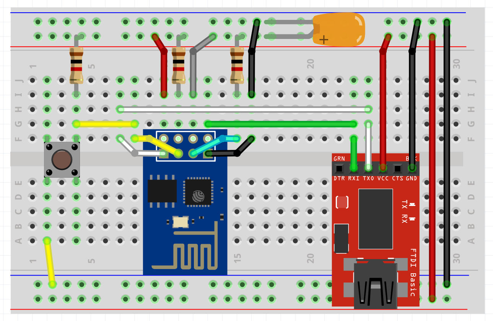

# OP-Z Artnet Adapter

This is the software for an OP-Z to Artnet adapter.
It can be connected via the USB-C connector on the OP-Z to control
Artnet-powered lighting fixtures and other devices via WiFi.

## Hardware

The module consists of an FTDI232 chip - immitating an ENTTEC DMX USB Pro -
and an ESP-01 module. Some passive components are required.

For more info about building the adapter, check out [fritzing/README.md](fritzing/README.md).

## Settings

Settings for your local Artnet setup can be changed in `artnet_settings.h`.
For changing the dmx configuration, check out [dmx/README.md](dmx/README.md).

